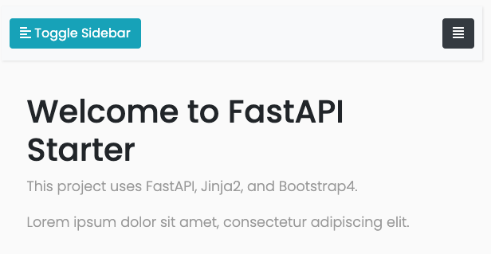

# Fastapi Web Starter

Please read the Medium article at [https://shinichiokada.medium.com/](https://shinichiokada.medium.com/).

[Please sign up for more free resources.](https://mailchi.mp/ae9891ba897a/codewithshin)

This repo includes all the file and it is ready to deploy to Heroku. 

- .env
- .gitignore
- app
- Procfile
- README.md
- requirements.txt
- runtime.txt
- static
- templates

## Installation

```
$ git clone git@github.com:shinokada/fastapi-web-starter.git
# Or using downloaded zip file 
$ unzip fastapi-web-starter.zip

# change the directory
$ cd fastapi-web-starter
# install packages
$ pip install -r requirements.txt
# start the server
$ uvicorn app.main:app --reload --port 8080
```

Visit http://127.0.0.1:8080/.



## Test

```
$ cd fastapi-web-starter
$ pytest -v
```